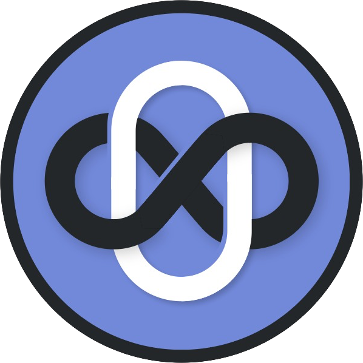

# Omni - A Discord bot that can do all the things!
OmniBot is a Discord bot that is still in early development. However, it will soon be the bot that can do everything you want it to do!



## Add Omni to your own Discord server
Click [here](https://discord.com/api/oauth2/authorize?client_id=811235136699891764&permissions=8&scope=bot) to invite Omni to your own Discord server and use ```!help``` to view a list of all available commands.

## Support
If you have any questions, comments or suggestions, please [make a new issue](https://github.com/mbreemhaar/omni/issues/new/choose). We will try to get back to you as soon as possible.

## Contributing
You can help us to develop Omni. Pull requests are welcome. For major changes, please open an issue first to discuss what you would like to change. Follow the instructions below to get a copy of Omni running on your system.

Omni uses the Discord<span></span>.py framework, of which the documentation can be found on [readthedocs.io](https://discordpy.readthedocs.io/).

### Requirements
#### Python 3
To be able to run Omni, you will need Python 3.5.3 or higher. We will assume you already have Python installed on your system. If you don't, have a look [here](https://realpython.com/installing-python/) to see how you can install it.

#### MongoDB
To store data like prefix settings and game scores, Omni uses MongoDB. Some features, like ```!teams``` and ```!roll``` will work without MongoDB, but we still recommend installing it. Instructions for this can be found [here](https://docs.mongodb.com/guides/server/install/).

### Running your own test server

1. Make your own bot account on the [Discord Developer Portal](https://discord.com/developers/). Instructions for doing this are available [here](https://discordpy.readthedocs.io/en/latest/discord.html).
2. Clone or download Omni's source code to your computer.
3. Install the necessary Python packages using ```pip install -r requirements.txt```
4. Set the ```DB_IP``` and ```DB_PORT``` environment variables to the values corresponding to your MongoDB database. By default, MongoDB will operate on ```localhost``` using port ```27017```. If the environment variables are not set, Omni will also default to this.
5. Now, you should be able to run the bot server using ```python omni.py your-bot-token```, where you use the token of the bot account you created in step 1.

## Authors and acknowledgements
- Vincent van Aalten - [Vycton](http://www.github.com/vycton) - _Building the modular feature architecture_
- Marco Breemhaar - [mbreemhaar](http://www.github.com/mbreemhaar) - _Programming and server management_
- Luuk van Dort - [NeonChicken](http://www.github.com/neonchicken) - _Building a large part of Omni's features_

Thanks to Toon van Dort for design the beautiful Omni logo and to the creators of [Discord.py](https://discordpy.readthedocs.io/), the awesome framework that Omni was built with.

## License
This project is licensed under the GNU General Public License v3.0 - see the [LICENSE](LICENSE) file for details.
